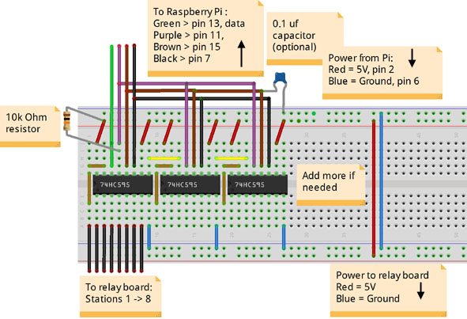

# A simple DIY relay interface

If you don't mind a little soldering you can build this simple but reliable circuit to connect 5V relay boards to your Raspberry Pi. This works with SIP without any software modification.

There are only a few inexpensive conponents needed:
- 74HC595 Shift Registers
- a few pin headers
- some jumper wires
- a bread board, perf board or other support

you can get them from most electrinics parts suppliers. for example Adafruit sells a 3 pack of [74HC595 chips](https://www.adafruit.com/products/450) for $2.75.

The diagram below shows a breadboard layout that supports up to 24 stations.

Each 74HC595 shift register allows you to connect 8 relays. You can chain as many shift registers togeather as needed.

If you will be using a large number of stations, especially if more that a couple of relays will be on at the same time, you should consider adding a separate power supply to run the relays.

